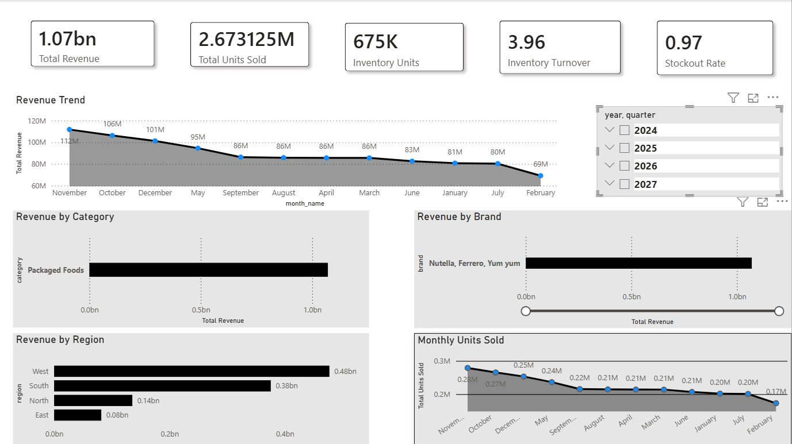
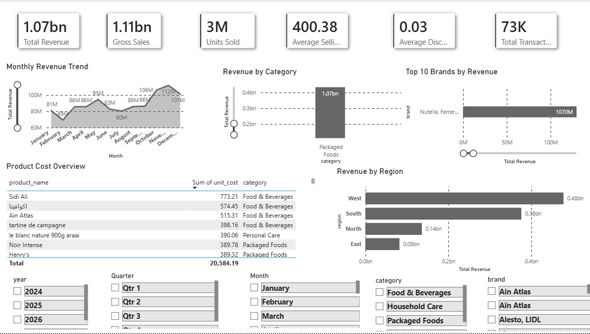
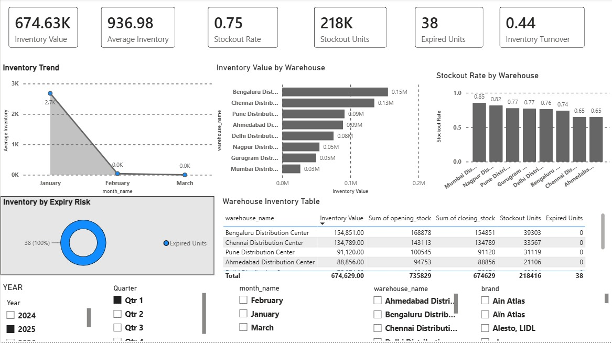

<h1 align="center">Hi, I'm Harshal Saudagar</h1>
<h3 align="center">Aspiring Data Analyst | SQL • Python • Power BI</h3>

<p align="center">

</p>

<p align="center">
<a href="https://github.com/harshalgit2005"></a>

</p>

---

## About Me

I'm an aspiring Data Analyst focused on turning raw data into business insights using SQL, Python, and Power BI. My projects follow an end-to-end analytics workflow — data collection, cleaning, modeling, SQL analysis, dashboard design, and business recommendations — built to simulate how analytics teams actually operate.

I'm particularly interested in supply chain, retail, and sales analytics, and I enjoy projects that answer a specific business question rather than just displaying charts.

**Currently building on:** Advanced SQL, Power BI/DAX, data modeling, business intelligence, and forecasting techniques.

---

## Tech Stack

<p>


</p>

| Category | Skills |
|---|---|
| Languages & Query | Python, SQL |
| Databases | MySQL, PostgreSQL, SQLite |
| BI & Visualization | Power BI, DAX, Excel, Data Modeling |
| Data Analysis | Pandas, NumPy, EDA |
| Machine Learning | Scikit-learn |
| APIs | REST APIs (Open Food Facts, Football-Data, FRED) |
| Tools | Git, GitHub, Jupyter, VS Code |

---

## Achievements

**HackerRank 5-Star Gold Badge in SQL** — solved problems across joins, window functions, CTEs, subqueries, and query optimization.
[View profile](https://www.hackerrank.com/profile/harshalvalmiksa1)

---

## Featured Projects

### FMCG Supply Chain Performance & Inventory Analytics

An end-to-end Business Intelligence project simulating the analytics environment of an FMCG organization — covering inventory optimization, supplier performance, logistics efficiency, and sales analytics.

**Stack:** Python, SQL, MySQL, Power BI, Open Food Facts API, FRED API

**Key KPIs tracked:** Revenue, Inventory Turnover, Days Inventory Outstanding, Stockout Rate, OTIF %, Fill Rate, Supplier Lead Time, Damage Rate

**Repository:** https://github.com/harshalgit2005/fmcg-supply-chain-performance-analytics

**Dashboard previews:**

| Executive Overview | Sales & Demand Analytics |
|---|---|
|  |  |

| Inventory Analytics | Supplier Performance |
|---|---|
|  |  |

*Operational KPIs dashboard is also available in the repository.*

---

### Football Performance Analytics

Match-level analytics exploring team performance, goal-scoring trends, and league competitiveness using API-sourced football data.

**Stack:** Python, SQL, MySQL, Power BI, Football-Data API

**Key KPIs tracked:** Total Matches, Goals per Match, Home/Away Wins, Team & League Comparison

**Repository:** https://github.com/harshalgit2005/football-analytics

**Dashboard preview:**


---

### Customer Churn Analysis

Identified customers at risk of churn and the key factors driving retention, using SQL for analysis and Power BI for reporting. Findings support targeted retention campaigns.

**Stack:** SQL, Python, Pandas, Power BI
**KPIs:** Churn Rate, Retention Rate, Customer Lifetime Value, Active Customers

**Repository:** https://github.com/harshalgit2005/customer-churn-analysis-sql-python

---

### Customer Behavior Analysis

Segmented customers and analyzed purchasing patterns to identify high-value segments and inform marketing strategy.

**Stack:** SQL, Python, Power BI

**Repository:** https://github.com/harshalgit2005/customer-behavior-analysis

---

### MindPulse — Mental Health Score Prediction

A machine learning web application that predicts mental health scores from lifestyle and behavioral indicators, served through a FastAPI backend with a real-time prediction interface.

**Stack:** Python, FastAPI, Scikit-learn, HTML, CSS, JavaScript

**Live demo:** https://mental-health-score-prediction-1-jdjx.onrender.com/
**Repository:** https://github.com/harshalgit2005/mental-health-score-prediction

---

### AI Personality Chatbot

A conversational AI chatbot that responds in different personality modes — Funny, Serious, Professional, and Sarcastic — with context-aware conversation handling.

**Stack:** Python, LangChain, Streamlit, Groq API

**Repository:** https://github.com/harshalgit2005/ai-personality-chatbot

---

## Analytics Workflow

```
Business Problem → Data Collection → Data Cleaning (Python/Pandas)
→ Data Modeling (MySQL) → SQL Analysis → EDA → Power BI Dashboard
→ Business Insights → Recommendations
```

---

## GitHub Stats

<p align="center">


</p>

---

## Career Objective

I'm looking to begin my career as a Data Analyst, applying SQL, Python, and Power BI to solve real business problems and grow within an experienced analytics team.

**Open to:** Data Analyst · Business Analyst · BI Analyst · Reporting Analyst · Junior Data Analyst

---

## Connect

<p align="center">
<a href="https://github.com/harshalgit2005"></a>
<a href="https://www.linkedin.com/in/harshalsaudagar"></a>
<a href="https://harshalgit2005.github.io/portfolio/"></a>
<a href="https://www.hackerrank.com/profile/harshalvalmiksa1"></a>
</p>

<p align="center">

</p>
