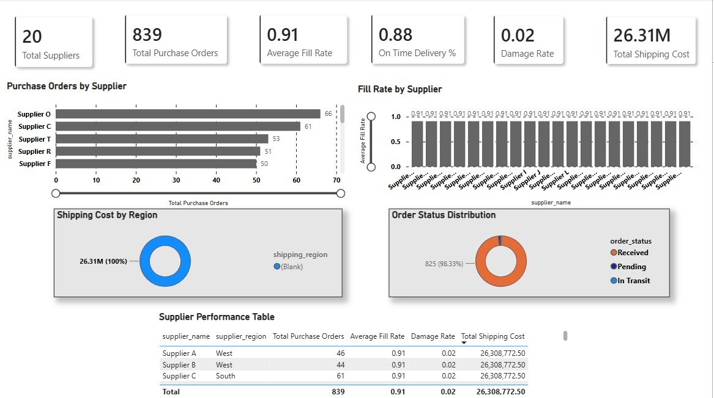

# Harshal Saudagar - Data Analysis Portfolio

## About

Hi, I'm Harshal! I'm an aspiring Data Analyst based in Pune, India, with a background in Information Technology. I focus on turning raw data into business insights using **SQL, Python, and Power BI**, building end-to-end analytics projects that simulate real business workflows — from data collection and cleaning to dashboard design and business recommendations.

I completed hands-on internship and simulation programs with YBI Foundation and the TATA Group (via Forage), and I'm particularly interested in supply chain, retail, and sales analytics.

My GitHub profile: [harshalgit2005](https://github.com/harshalgit2005)
My portfolio site: [harshalgit2005.github.io/portfolio](https://harshalgit2005.github.io/portfolio/)
My HackerRank profile (5-Star Gold Badge in SQL): [harshalvalmiksa1](https://www.hackerrank.com/profile/harshalvalmiksa1)

 
This repository serves to showcase my skills and as a platform to share my projects, and a way to track my progress in Data Analytics.
 

## Table of contents
- [About](#about)
- [Study & Simulation Programs](#study--simulation-programs)
  + [YBI Foundation Internship](#ybi-foundation-internship)
  + [TATA Group Data Analytics Simulation](#tata-group-data-analytics-simulation)
- [Portfolio Projects](#portfolio-projects)
  + [FMCG Supply Chain Performance & Inventory Analytics](#fmcg-supply-chain-performance--inventory-analytics)
  + [Football Performance Analytics](#football-performance-analytics)
  + [Customer Churn Analysis](#customer-churn-analysis)
  + [Customer Behavior Analysis](#customer-behavior-analysis)
  + [MindPulse - Mental Health Score Prediction](#mindpulse---mental-health-score-prediction)
  + [AI Personality Chatbot](#ai-personality-chatbot)
- [Skills & Technologies](#skills--technologies)
- [Certificates](#certificates)
- [Contacts](#contacts)

## Study & Simulation Programs
In this section I list internship and job-simulation programs I've completed that shaped my analytics and data foundations.

### YBI Foundation Internship
**Description:** A data science / Python internship program with YBI Foundation, covering practical exposure to data analysis workflows and Python-based problem solving.
**Status:** Completed.

### TATA Group Data Analytics Simulation
**Description:** A virtual job simulation program via Forage, replicating the day-to-day tasks of a Data Analyst at TATA Group — including data analysis and business-focused recommendations.
**Status:** Completed.

## Portfolio Projects
In this section I list my data analytics projects, briefly describing the technology stack and business outcome for each.

### FMCG Supply Chain Performance & Inventory Analytics
**Code:** [go to repo..](https://github.com/harshalgit2005/fmcg-supply-chain-performance-analytics)
**Description:** An end-to-end Business Intelligence project simulating the analytics environment of an FMCG organization. It integrates live product data with operational datasets to analyze inventory optimization, supplier performance, logistics efficiency, and sales trends.
**Skills:** Data collection via API, data cleaning, relational data modeling, SQL business analysis, KPI design, dashboard development.
**Technology:** Python, Pandas, NumPy, MySQL, SQL, Power BI, Open Food Facts API, FRED API.
**Results:** A five-page Power BI dashboard suite (Executive Overview, Sales & Demand, Inventory Analytics, Supplier Performance, Operational KPIs) tracking metrics such as Revenue, Inventory Turnover, Days Inventory Outstanding, Stockout Rate, OTIF %, Fill Rate, and Damage Rate, with business recommendations on replenishment planning and supplier prioritization.

**Dashboard previews:**

| Executive Overview | Sales & Demand Analytics |
|---|---|
|  |  |

| Inventory Analytics | Supplier Performance |
|---|---|
|  |  |

*Operational KPIs dashboard is also available in the repository.*

### Football Performance Analytics
**Code:** [go to repo..](https://github.com/harshalgit2005/football-analytics)
**Description:** An end-to-end analytics project focused on football performance analysis using match data collected through APIs, exploring team performance, goal-scoring trends, and league competitiveness.
**Skills:** API data collection, SQL analysis, dashboard design.
**Technology:** Python, SQL, MySQL, Power BI, Football-Data API.
**Results:** Interactive dashboards covering Total Matches, Goals per Match, Home/Away Wins, and Team vs. League comparisons. *(Dashboard preview coming soon — full Power BI file available in the repository.)*

### Customer Churn Analysis
**Code:** [go to repo..](https://github.com/harshalgit2005/customer-churn-analysis-sql-python)
**Description:** Identified customers at risk of churn and the key factors influencing retention, to support targeted retention campaigns.
**Skills:** SQL querying, exploratory data analysis, KPI tracking, dashboard reporting.
**Technology:** SQL, Python, Pandas, Power BI.
**Results:** A churn-risk analysis with Churn Rate, Retention Rate, Customer Lifetime Value, and Active Customer metrics, supporting recommendations for high-risk customer segments.

### Customer Behavior Analysis
**Code:** [go to repo..](https://github.com/harshalgit2005/customer-behavior-analysis)
**Description:** Analyzed purchasing behavior to identify high-value customers and inform marketing strategy.
**Skills:** Customer segmentation, purchase pattern analysis, SQL analysis.
**Technology:** SQL, Python, Power BI.
**Results:** Customer segments and purchase-pattern insights to support targeted marketing decisions.

### MindPulse - Mental Health Score Prediction
**Code:** [go to repo..](https://github.com/harshalgit2005/mental-health-score-prediction)
**Live Demo:** [go to demo..](https://mental-health-score-prediction-1-jdjx.onrender.com/)
**Description:** A machine learning application predicting mental health scores from lifestyle and behavioral indicators, served through a real-time prediction API with an interactive web interface.
**Skills:** ML model building, API development, frontend integration.
**Technology:** Python, Scikit-learn, FastAPI, HTML, CSS, JavaScript.
**Results:** A deployed, live prediction service combining a trained ML model with a FastAPI backend and a custom-built frontend.

### AI Personality Chatbot
**Code:** [go to repo..](https://github.com/harshalgit2005/ai-personality-chatbot)
**Description:** A conversational AI chatbot capable of responding in multiple personalities — Funny, Serious, Professional, and Sarcastic — with context-aware conversation handling.
**Skills:** Prompt engineering, conversational AI design, interactive UI development.
**Technology:** Python, LangChain, Streamlit, Groq API.
**Results:** A working multi-personality chatbot demonstrating applied LLM and prompt-engineering skills.

## Skills & Technologies

| Category | Skills |
|---|---|
| Languages & Query | Python, SQL |
| Databases | MySQL, PostgreSQL, SQLite |
| BI & Visualization | Power BI, DAX, Excel, Matplotlib, Plotly, Data Modeling |
| Data Analysis | Pandas, NumPy, EDA |
| Machine Learning / AI | Scikit-learn, LangChain, FastAPI |
| APIs | REST APIs (Open Food Facts, Football-Data, FRED) |
| Tools | Git, GitHub, Jupyter, VS Code |

## Certificates
I believe the best way to showcase skills is by doing and sharing the work itself, but certificates are still a useful signal. Here are the programs I've completed:
- HackerRank SQL (5-Star Gold Badge) — [View profile](https://www.hackerrank.com/profile/harshalvalmiksa1)
- Data Science / Python Internship — YBI Foundation
- Data Analytics Job Simulation — TATA Group (via Forage)

## Contacts
- LinkedIn: [harshalsaudagar](https://www.linkedin.com/in/harshalsaudagar)
- GitHub: [harshalgit2005](https://github.com/harshalgit2005)
- Portfolio: [harshalgit2005.github.io/portfolio](https://harshalgit2005.github.io/portfolio/)
